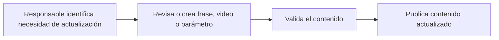

# Proceso de negocio 4: Gestión de contenidos

```mermaid
flowchart LR
  A[Responsable identifica necesidad de actualización] --> B[Revisa o crea frase, video o parámetro]
  B --> C[Valida el contenido]
  C --> D[Publica contenido actualizado]
```

**Descripción:** mantenimiento del catálogo de contenidos que apoya los procesos de comunicación.