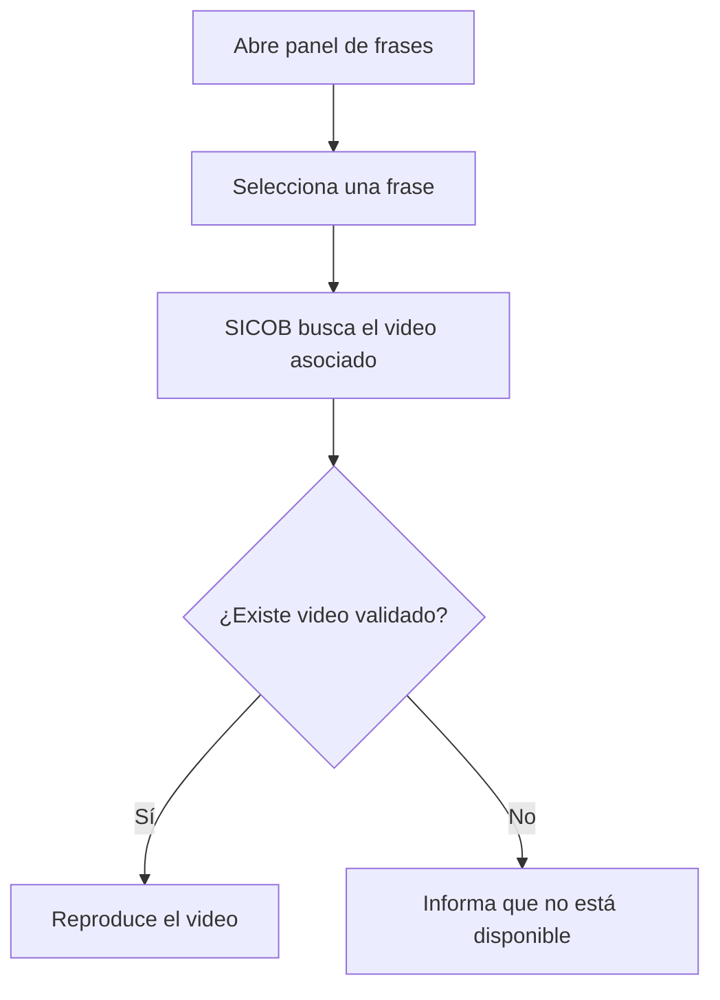

# CU-02 — Consultar frase mediante video LSC

**Actor:** persona oyente.

```mermaid
flowchart TD
  A[Abre panel de frases] --> B[Selecciona una frase]
  B --> C[SICOB busca el video asociado]
  C --> D{¿Existe video validado?}
  D -- Sí --> E[Reproduce el video]
  D -- No --> F[Informa que no está disponible]
```

**Resultado:** el usuario consulta el clip asociado o recibe una indicación clara si no existe.