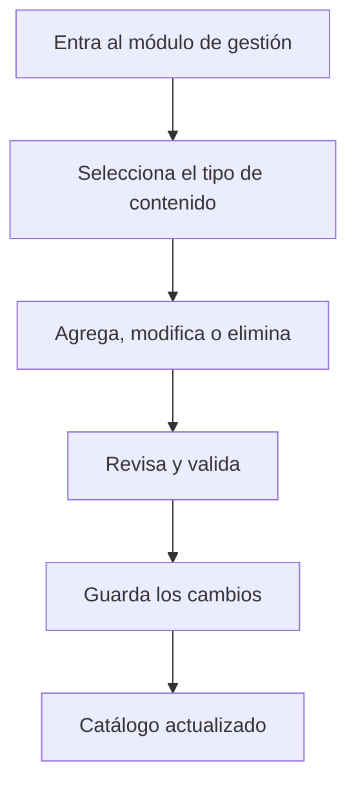

# CU-04 — Gestionar contenidos

**Actor:** administrador de contenidos.

```mermaid
flowchart TD
  A[Entra al módulo de gestión] --> B[Selecciona el tipo de contenido]
  B --> C[Agrega, modifica o elimina]
  C --> D[Revisa y valida]
  D --> E[Guarda los cambios]
  E --> F[Catálogo actualizado]
```

**Precondición:** usuario autorizado. La autenticación y persistencia reales quedan fuera de la maqueta inicial.